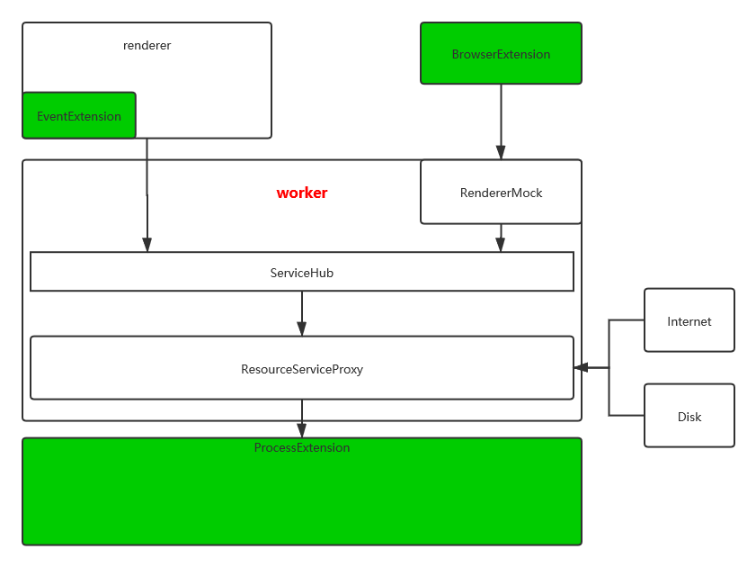

# 整体框架  

ts部分的整体框架如下图所示，renderer和worker分别代表了Electron中的渲染进程和工作进程：  

绿色部分代表了可以添加的扩展类型。
其中EventExtension表示那些不需要单独进程的扩展，例如UI渲染等扩展；BrowserExtension表示浏览器扩展，它独立于civet存在，同时它又作为UI功能的延伸，将浏览器与civet衔接在一起；ProcessExtension则是进程级别的扩展，它可以用来处理一些任务繁重的工作，例如耗时的算法处理。  
而RendererMock、ServiceHub和ResourceServiceProxy则代表了worker进程中的三个重要类。  
RendererMock是一个包装器，使用websocket与浏览器扩展进行通信，并按照通讯协议，将请求转换为操作，以模拟renderer对ServiceHub发出的请求。  
ResourceServiceProxy是一个资源代理，它决定了资源是从网络下载，还是从本地载入，或者该如何保存、处理。  